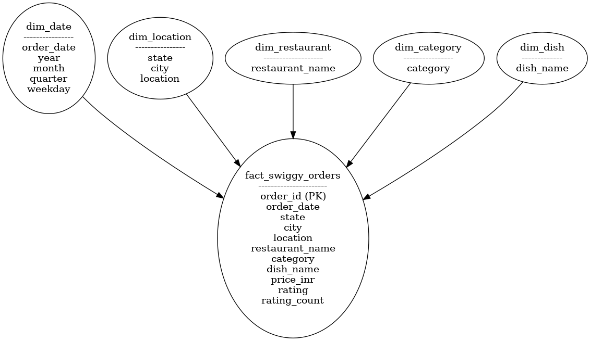
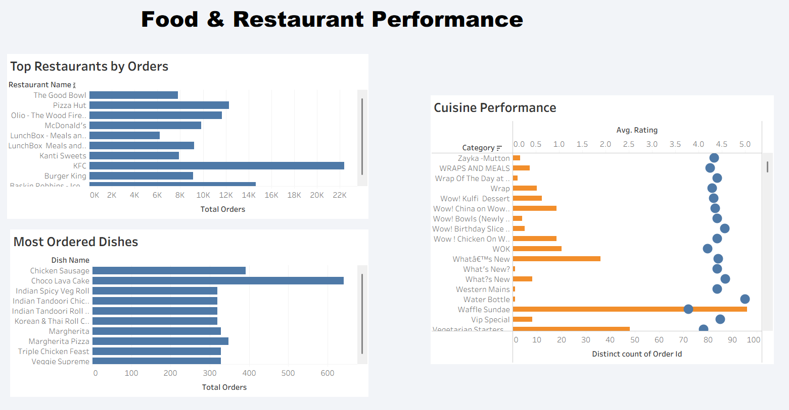

# 📊 Swiggy Sales Analysis – SQL & Tableau Project

## 📌 Project Overview
This project presents an **end-to-end sales analysis of Swiggy food delivery data** using **SQL and Tableau**.  
The objective is to clean and structure raw transactional data, build meaningful KPIs, and deliver **business-ready dashboards** that provide insights into order trends, revenue performance, location analysis, food preferences, and customer spending behavior.

The project follows **industry best practices**, including data validation, star schema modeling, and clear documentation, making it suitable for analytics portfolios and interviews.

---

## 🛠️ Tech Stack
- **SQL (MySQL)** – Data cleaning, validation, and data modeling  
- **Tableau** – Interactive dashboard creation and visualization  
- **Excel** – Data dictionary documentation  
- **GitHub** – Version control and project presentation  

---

## 📂 Repository Structure
swiggy-sales-analysis-sql/
│
├── data/
│   └── swiggy_data.csv
│
├── docs/
│   ├── erd_star_schema.png
│   └── data_dictionary.xlsx
│
├── sql/
│   ├── 01_data_cleaning.sql
│   ├── 02_duplicate_removal.sql
│   ├── 03_star_schema.sql
│   ├── 04_fact_load.sql
│   ├── 05_kpi_queries.sql
│   └── 06_business_analysis.sql
│
├── tableau/
│   ├── swiggy_dashboard.twbx
│   └── screenshots/
│       ├── executive_overview.png
│       ├── location_intelligence.png
│       ├── food_restaurant_performance.png
│       └── customer_spending_ratings.png
│
├── README.md
└── LICENSE

---

## 🧹 Data Cleaning & Validation
The raw Swiggy dataset was validated using SQL to ensure data quality:
- Null value checks on critical columns  
- Blank / empty string detection  
- Duplicate record identification  
- Duplicate removal using window functions  

These steps ensured reliable and consistent analytics.

---

## 🧩 Data Modeling
A **Star Schema** was designed to optimize analytical performance and reporting.

### 🔹 Central Fact Table
- `fact_swiggy_orders` – Stores order-level metrics such as price, rating, and rating count.

### 🔹 Dimension Tables
- `dim_date` – Year, month, quarter, weekday  
- `dim_location` – State, city, delivery location  
- `dim_restaurant` – Restaurant details  
- `dim_category` – Cuisine type  
- `dim_dish` – Dish information  

### 📌 Star Schema ERD

---

## 📈 Key Performance Indicators (KPIs)
- Total Orders  
- Total Revenue (INR Million)  
- Average Dish Price  
- Average Rating  

---

## 📊 Tableau Dashboards

### 1️⃣ Executive Overview
High-level KPIs and overall business performance trends.

---

### 2️⃣ Location Intelligence
City-wise and state-wise order and revenue analysis.

---

### 3️⃣ Food & Restaurant Performance
Top restaurants, cuisines, and most ordered dishes.

---

### 4️⃣ Customer Spending & Ratings
Price bucket analysis and customer rating distribution.

---

## 📂 Documentation
- 📘 **Data Dictionary:** Column definitions, data types, and business meaning  
  - `docs/data_dictionary.xlsx`
- 🗂 **ERD Diagram:** Star schema data model  
  - `docs/erd_star_schema.png`

---

## 📥 How to Use This Project
1. Clone or download the repository  
2. Download `swiggy_data.csv` from the `data` folder  
   > *Note: GitHub does not preview large CSV files, but it is available for download*  
3. Open `swiggy_dashboard.twbx` in Tableau  
4. Explore dashboards and insights  

---

## 💡 Business Insights (Sample)
- Metro cities generate the highest order volume, but not always the highest revenue  
- Certain cuisines show high demand but lower average ratings, indicating quality gaps  
- Mid-range price buckets (₹200–₹499) dominate order volume  
- Weekend order volume peaks significantly compared to weekdays  

---

## 🎯 Key Takeaways
- Demonstrates strong **SQL fundamentals** and data modeling skills  
- Shows ability to translate raw data into **actionable business insights**  
- Follows a **clean, professional project structure**  
- Ready for **interviews, resumes, and analytics portfolios**

---

## 📄 License
This project is licensed under the **MIT License**.
